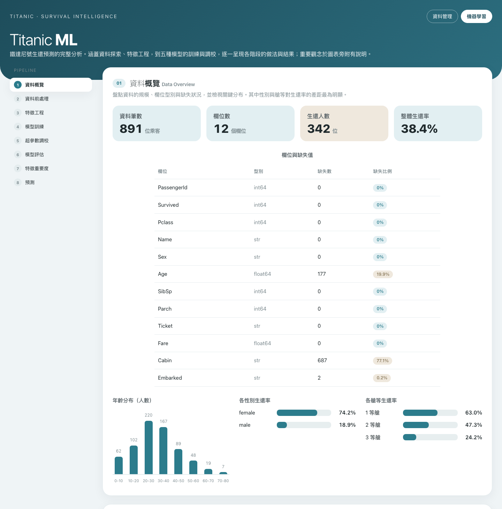
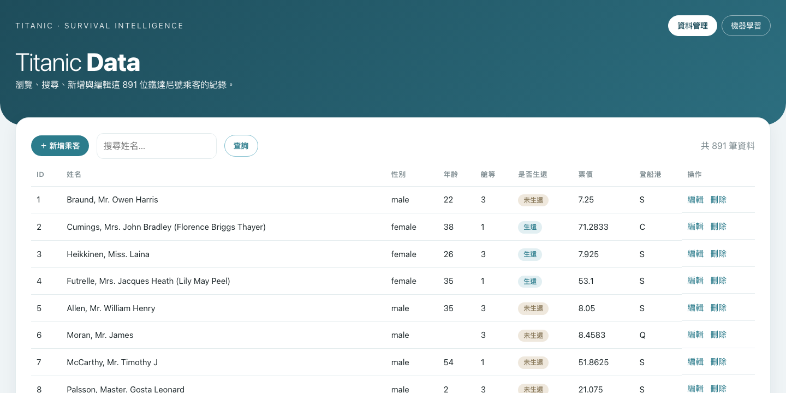

# 使用 RESTful API 與 Ajax 進行機器學習模型訓練與預測

以鐵達尼號資料集為例，透過 Flask 提供 RESTful API，前端以原生 JavaScript（Ajax）呼叫，完成資料管理（CRUD）與完整的機器學習流程：資料探索、前處理、特徵工程、多模型訓練與超參數調校、模型評估，以及單筆／批次預測。

## 專案結構

```
titanic/
├── models/                       # 訓練後存下的最佳模型與中繼資料
│   ├── titanic_model.joblib      # 最佳模型（含前處理的完整 Pipeline）
│   ├── meta.json                 # 這次訓練的完整結果（比較表、指標、超參數）
│   └── history.json              # 歷次訓練紀錄
├── titanic_restful_project/      # 網站主程式
│   ├── app.py                    # Flask：頁面路由與 REST API
│   ├── ml.py                     # 機器學習核心（前處理／訓練／評估／預測）
│   ├── init_db.py                # 匯入 CSV、建立 SQLite 資料庫
│   ├── my_db.db                  # SQLite 資料庫
│   ├── titanic.csv               # 原始資料（891 筆）
│   ├── requirements.txt
│   ├── templates/                # 頁面（index / new / edit / ml）
│   ├── static/                   # 共用樣式 app.css
│   └── doc/                      # 詳細技術說明與導覽講稿
└── README.md
```

## 安裝套件

- Flask==3.1.3
- pandas==3.0.3
- numpy==2.4.6
- scikit-learn==1.9.0
- joblib==1.5.3
- xgboost==3.3.0

（版本號可用 `pip list` 或 `conda list` 檢視，實際版本可能不同，請自行調整。）

建議在虛擬環境安裝：

```bash
python -m venv .venv
source .venv/bin/activate            # Windows 使用 .venv\Scripts\activate
pip install -r titanic_restful_project/requirements.txt
```

## 執行方法

```bash
cd titanic_restful_project
python init_db.py      # 從 titanic.csv 建立 SQLite 資料庫 my_db.db
python app.py          # 啟動網站
```

開啟瀏覽器：

- 資料管理（CRUD）：http://127.0.0.1:5000/
- 機器學習儀表板：http://127.0.0.1:5000/ml

模型的儲存與載入（`ml.py` 內採用此方式）：

```python
import joblib

# 儲存模型（訓練完成後自動存到 models/）
joblib.dump(best_estimator, 'models/titanic_model.joblib')

# 載入模型
model = joblib.load('models/titanic_model.joblib')

# 預測
y_pred = model.predict(X_test)
y_prob = model.predict_proba(X_test)
```

## 說明

分析流程依序為：資料探索 → 資料前處理 → 特徵工程 → 模型訓練 → 超參數調校 → 模型評估 → 特徵重要度 → 預測。

**前處理**

- 數值欄位（Age、Fare、FamilySize）以中位數補缺，並做標準化（StandardScaler）。
- 類別欄位（Pclass、Sex、Embarked、Title、IsAlone）以眾數補缺，並做 One-Hot 編碼。
- 前處理與模型以 scikit-learn 的 Pipeline 綁在一起，訓練與預測共用同一套，避免不一致。

**特徵工程**

- Title：從姓名抽出稱謂（Mr / Mrs / Miss / Master / Rare）。
- FamilySize：由 SibSp 與 Parch 合成同行人數。
- IsAlone：是否獨自搭船。

**模型（五種，各以 GridSearchCV、5-fold 交叉驗證調參）**

- Logistic Regression（baseline）
- Decision Tree
- Random Forest
- SVM
- XGBoost

**目前最佳結果**

- 最佳模型：SVM（kernel=linear、C=1）。
- 測試準確率約 84.4%、ROC-AUC 約 0.86。
- 特徵工程消融對照（固定最佳模型）：有特徵工程 84.4% 對比無特徵工程 79.3%，約提升 5 個百分點。

超參數調校頁面提供互動式試跑，可自訂 Random Forest 的搜尋範圍（n_estimators、max_depth、min_samples_split）即時重跑並比較最佳組合。

完整技術說明見 `titanic_restful_project/doc/說明文件.md`

## 成果

機器學習儀表板：



資料管理頁面：



介紹影片：https://www.youtube.com/watch?v=rOpdVcMcVQc


## 其它

- 所有圖表以原生 SVG 與 CSS 繪製，無外部圖表套件，離線亦可運作。
- 訓練在背景執行緒進行，頁面以輪詢顯示進度，看得到「訓練中」到「完成」。
- 訓練完成後模型持久化到 `models/`，重整頁面或重開伺服器都能還原。
