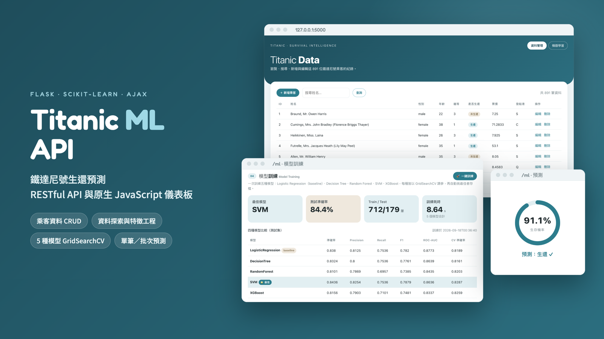
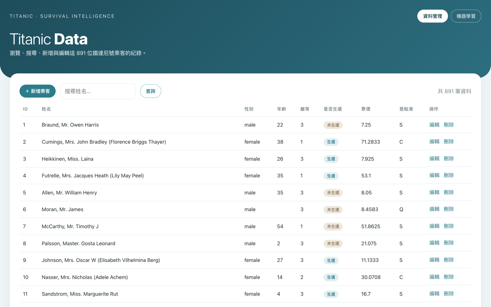
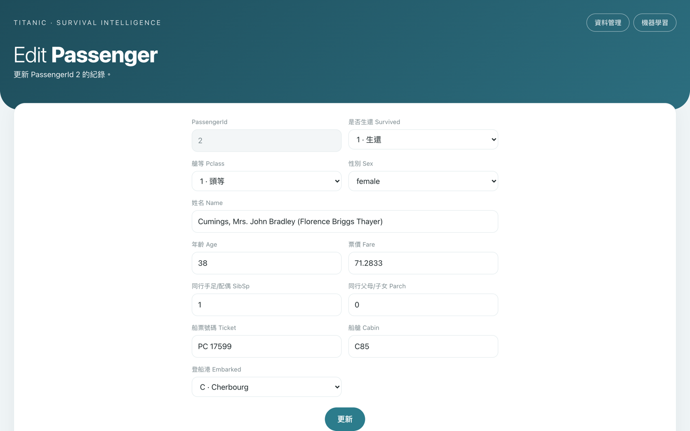
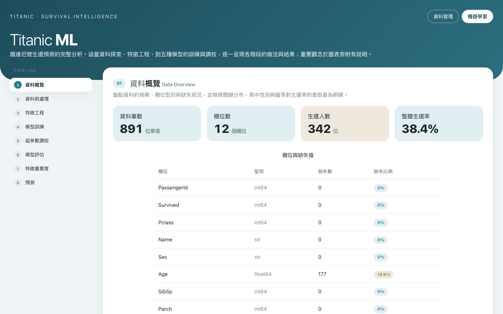
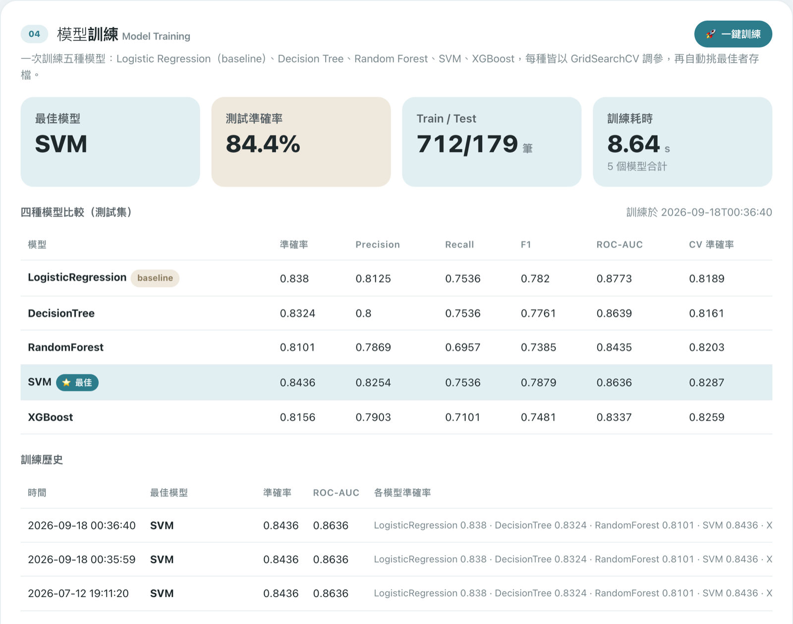
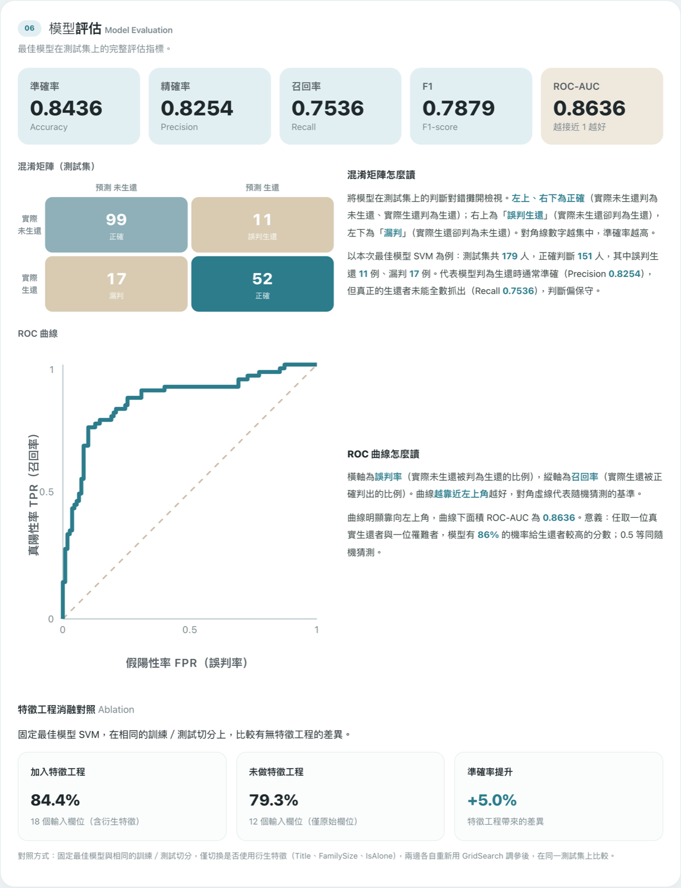
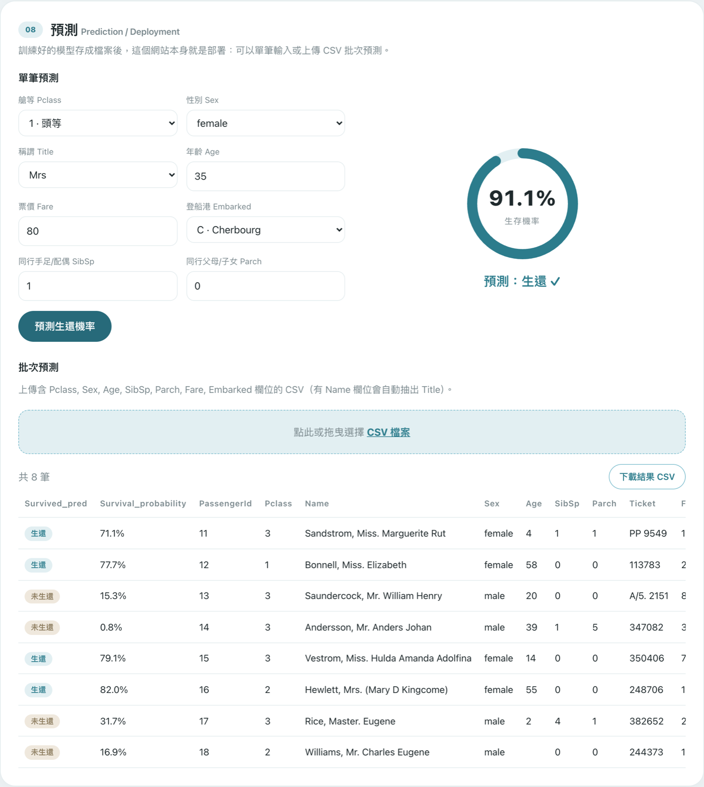
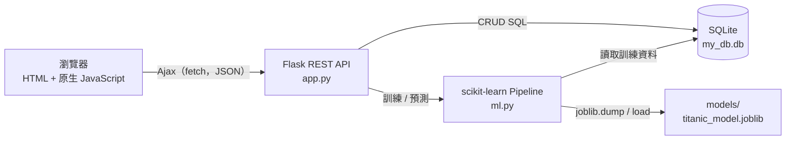

# Titanic ML API

> A Flask RESTful API with a vanilla JavaScript (Ajax) dashboard for Titanic survival prediction: CRUD, EDA, model training and prediction.

用鐵達尼號 891 位乘客的資料，做出一個可以管理資料、訓練模型、預測生還機率的網站。後端是 Flask 寫的 RESTful API，前端用原生 JavaScript 以 Ajax 呼叫，適合拿來對照 REST API、Ajax 跟 scikit-learn 在同一個專案裡怎麼分工。


[](https://www.youtube.com/watch?v=rOpdVcMcVQc)



## 功能

### 乘客資料管理

首頁列出全部乘客，每頁 20 筆，可以用姓名搜尋。每一筆都能編輯或刪除，右上角的「新增乘客」會開新增表單。這些操作都是 CRUD（新增、查詢、修改、刪除），前端用 `fetch()` 打 `/api/passengers` 這組 API，頁面不用重新整理。

<p>
  
  
</p>

資料表在 `init_db.py` 建立時就加上 CHECK 限制，例如 `Survived` 只能是 0 或 1、`Age` 要介於 0 到 120，填錯的資料寫不進資料庫。

### 機器學習儀表板

`/ml` 頁面左側是 8 個步驟的流程導覽：資料概覽、資料前處理、特徵工程、模型訓練、超參數調校、模型評估、特徵重要度、預測。捲動的時候，左側會標出目前看到哪一步。



前三步用 `/api/stats` 的資料畫圖，包含欄位缺失值、年齡分布、各性別與各艙等的生還率。前處理跟特徵工程的做法如下：

| 步驟 | 欄位 | 做法 |
| --- | --- | --- |
| 補缺值 | Age、Fare、FamilySize | 中位數 |
| 補缺值 | Pclass、Sex、Embarked、Title、IsAlone | 眾數 |
| 標準化 | Age、Fare、FamilySize | StandardScaler（把數值換算成平均 0、標準差 1） |
| 類別編碼 | Pclass、Sex、Embarked、Title、IsAlone | One-Hot（每個類別值拆成一個 0/1 欄位） |
| 特徵工程 | Title | 從姓名抽出稱謂：Mr、Mrs、Miss、Master，其他歸為 Rare |
| 特徵工程 | FamilySize | SibSp + Parch + 1，同行人數 |
| 特徵工程 | IsAlone | FamilySize 等於 1 時為獨自搭船 |

Cabin 缺了 687 筆，Name 原文跟 Ticket 幾乎每人都不同，這三個欄位不進模型。

### 多模型訓練與超參數調校

按「一鍵訓練」後，伺服器在背景執行緒訓練五種模型，前端每 1.2 秒問一次進度。每種模型都用 GridSearchCV（把參數組合全部試一遍，用 5-fold 交叉驗證挑分數最高的一組）調參，最後挑測試集準確率最高的模型存檔。

| 模型 | 搜尋的超參數 |
| --- | --- |
| Logistic Regression（baseline） | C |
| Decision Tree | max_depth、min_samples_split |
| Random Forest | n_estimators、max_depth、min_samples_split |
| SVM | C、kernel |
| XGBoost | n_estimators、max_depth、learning_rate |



資料以 8:2 分層切成訓練集跟測試集，`random_state=42` 固定，每次訓練的結果一致。超參數調校區另外提供 Random Forest 的自訂試跑，可以輸入自己的搜尋範圍，試跑結果不會覆蓋已存檔的模型。

### 模型評估

最佳模型在測試集上的 Accuracy、Precision、Recall、F1、ROC-AUC（隨機抽一位生還者跟一位罹難者，模型把生還者分數排得比較高的機率），加上混淆矩陣、ROC 曲線，還有特徵工程的消融對照（ablation：同一種模型、同樣的切分，改用沒有衍生特徵的原始欄位重新調參，比較準確率差多少）。



用 `random_state=42` 訓練出來的結果：

| 項目 | 數值 |
| --- | --- |
| 最佳模型 | SVM（kernel=linear、C=1） |
| 測試集準確率 | 0.8436 |
| ROC-AUC | 0.8636 |
| 有特徵工程（18 個輸入欄位） | 84.4% |
| 沒有特徵工程（12 個輸入欄位） | 79.3% |

### 預測

單筆預測填入艙等、性別、稱謂、年齡等欄位，回傳生還機率，0.5 以上判為生還。批次預測上傳 CSV，每一列會加上 `Survived_pred` 跟 `Survival_probability` 兩欄，可以下載結果。CSV 有 Name 欄位時會自動抽出 Title。



## 技術架構



| 層 | 技術 | 負責的事 |
| --- | --- | --- |
| 前端 | HTML、CSS、原生 JavaScript | 用 `fetch()` 拿 JSON 再組成畫面；圖表用 inline SVG 跟 CSS 自己畫，沒有引用圖表套件 |
| API | Flask 3.1 | `app.py` 只處理路由，把請求轉給資料庫或 `ml.py` |
| 資料庫 | SQLite | `titanic` 資料表，891 筆乘客資料 |
| 機器學習 | scikit-learn 1.9、XGBoost 3.3、pandas | Pipeline（把前處理跟模型串成同一條流程）負責補值、編碼、訓練、評估、預測 |
| 模型存檔 | joblib | 最佳模型連同前處理存成一個檔案，`meta.json` 記錄這次結果，`history.json` 記錄歷次訓練 |

前處理跟模型包在同一個 Pipeline 裡，訓練跟預測用的是同一套轉換。存檔後重開伺服器，頁面載入時會打 `/api/model/info` 還原上次的結果，不用重新訓練。在其他程式裡也可以直接載入模型：

```python
import joblib

model = joblib.load("models/titanic_model.joblib")
y_pred = model.predict(X_test)
y_prob = model.predict_proba(X_test)
```

`X_test` 要先經過 `ml.py` 的 `_prep_frame()` 產生 Title、FamilySize、IsAlone 三個欄位。

## API 端點

頁面路由：

| 方法 | 路徑 | 做什麼 |
| --- | --- | --- |
| GET | `/` | 乘客資料管理頁 |
| GET | `/passengers/new` | 新增乘客表單 |
| GET | `/passengers/<id>/edit` | 編輯乘客表單 |
| GET | `/ml` | 機器學習儀表板 |

REST API：

| 方法 | 路徑 | 做什麼 |
| --- | --- | --- |
| GET | `/api/passengers?page=1&per_page=20&search=` | 分頁列出乘客，可用姓名搜尋 |
| GET | `/api/passengers/<id>` | 取得單一乘客，找不到回 404 |
| POST | `/api/passengers` | 新增乘客，成功回 201 |
| PUT | `/api/passengers/<id>` | 修改乘客 |
| DELETE | `/api/passengers/<id>` | 刪除乘客 |
| GET | `/api/stats` | 資料概覽，給前三步的圖表用 |
| POST | `/api/train` | 在背景開始訓練，回 202；訓練中再送會回 409 |
| GET | `/api/train/status` | 訓練狀態：idle、training、done、error |
| GET | `/api/model/info` | 目前存檔模型的完整結果 |
| GET | `/api/history` | 歷次訓練紀錄 |
| POST | `/api/tune` | 自訂超參數試跑，最多 60 組，不覆蓋存檔模型 |
| POST | `/api/predict` | 單筆預測，回傳 `survived` 跟 `probability` |
| POST | `/api/predict/batch` | 上傳 CSV（表單欄位名稱 `file`）批次預測 |

單筆預測的範例：

```bash
curl -X POST http://127.0.0.1:5000/api/predict \
  -H "Content-Type: application/json" \
  -d '{"Pclass":3,"Sex":"male","Age":22,"SibSp":1,"Parch":0,"Fare":7.25,"Embarked":"S","Title":"Mr"}'
# {"probability":0.1564,"survived":0}
```

## 本機跑起來

repo 裡已經附上資料庫 `my_db.db` 跟訓練好的模型，裝完套件就能直接開。

```bash
git clone https://github.com/hsuiris/titanic-ml-api.git
cd titanic-ml-api
python3 -m venv .venv
source .venv/bin/activate          # Windows 改用 .venv\Scripts\activate
pip install -r titanic_restful_project/requirements.txt
cd titanic_restful_project
python app.py
```

打開瀏覽器：

- 資料管理：http://127.0.0.1:5000/
- 機器學習儀表板：http://127.0.0.1:5000/ml

macOS 的「AirPlay 接收器」預設會占用 5000 port，開不起來的話換一個 port：

```bash
flask --app app run --port 5001
```

其他指令（都在 `titanic_restful_project/` 底下執行）：

```bash
python init_db.py   # 從 titanic.csv 重建資料庫，原本新增或修改的資料會清掉
python ml.py        # 訓練一次並自我檢查：5 個模型結果、單筆預測、訓練紀錄
```

`requirements.txt` 的版本是開發時用的版本，換成其他版本可能需要自行調整。

## 專案結構

```
titanic-ml-api/
├── models/                     # 訓練後存下的模型
│   ├── titanic_model.joblib    # 最佳模型（含前處理的完整 Pipeline）
│   ├── meta.json               # 這次訓練的比較表、指標、超參數
│   └── history.json            # 歷次訓練紀錄
├── titanic_restful_project/
│   ├── app.py                  # Flask：頁面路由與 REST API
│   ├── ml.py                   # 前處理、訓練、評估、預測
│   ├── init_db.py              # 匯入 CSV、建立 SQLite 資料庫
│   ├── my_db.db                # SQLite 資料庫
│   ├── titanic.csv             # 原始資料（891 筆）
│   ├── requirements.txt
│   ├── templates/              # index、new、edit、ml 四個頁面
│   ├── static/app.css          # 共用樣式
│   └── doc/                    # 詳細技術說明
└── docs/screenshots/           # README 用的截圖
```

資料分析結論、程式設計取捨等更完整的說明，在 [`titanic_restful_project/doc/說明文件.md`](titanic_restful_project/doc/說明文件.md)。
